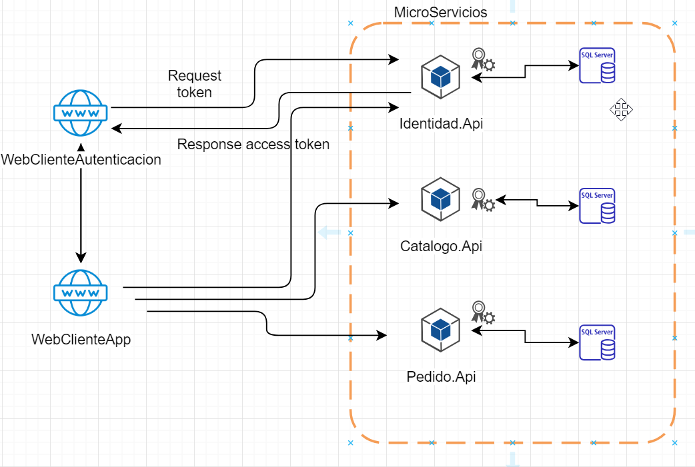

# Examen Comercio Truper - Microservice Arquitectura .NET Core
Tener una solución integral de una pantalla creada en un Front End con el fin de permitir la captura de un pedido y detalle de pedido, consulta y el borrado de esteusando una arquitectura orientada a microservicios y .NET Core.




## ¿Cómo levantar el proyecto?
### 1. Cambiar las cadenas de conexión
Actualicen las cadenas de conexión de cada Microservicio por la de ustedes.

### 2. Actualizar los puertos de los proyectos web
* Cliente.Web.Autenticacion: localhost:6471
* Cliente.Web.Comercio localhost:60001
* Identidad.Api: localhost:1057
* Pedido.Api localhost:1082
* Catalogo.Api localhost:1123


### 3. Ejecutar las migraciones
```
update-database -context ApplicationDbContext
```

### 4. Agregar un usuario por defecto a la base de datos
```
INSERT [Identity].[AspNetUsers] ([Id], [UserName], [NormalizedUserName], [Email], [NormalizedEmail], [EmailConfirmed], [PasswordHash], [SecurityStamp], [ConcurrencyStamp], [PhoneNumber], [PhoneNumberConfirmed], [TwoFactorEnabled], [LockoutEnd], [LockoutEnabled], [AccessFailedCount], [FirstName], [LastName]) VALUES (N'cc7deafd-2977-4c1b-91ad-7b8d37a01ffe', N'admin@ADMIN.com', N'ADMIN@ADMIN.COM', N'admin@ADMIN.com', N'ADMIN@admin.com', 0, N'AQAAAAEAACcQAAAAEL5faIXPhAOdXYU+vAAKbF32yd2ONSGUdGJ6wo9jkhm8KKlLF/h5x0zjJbcPKt8WYg==', N'PS7QHYXIO4NUC65ZYEP4SBEYOXP4DTWA', N'e955992b-abf5-41d3-b504-ec6dc0632989', NULL, 0, 0, NULL, 1, 0, N'Rafael', N'Huesca Espindola')

```
    Usuario: admin@ADMIN.com

    Password: 123456
